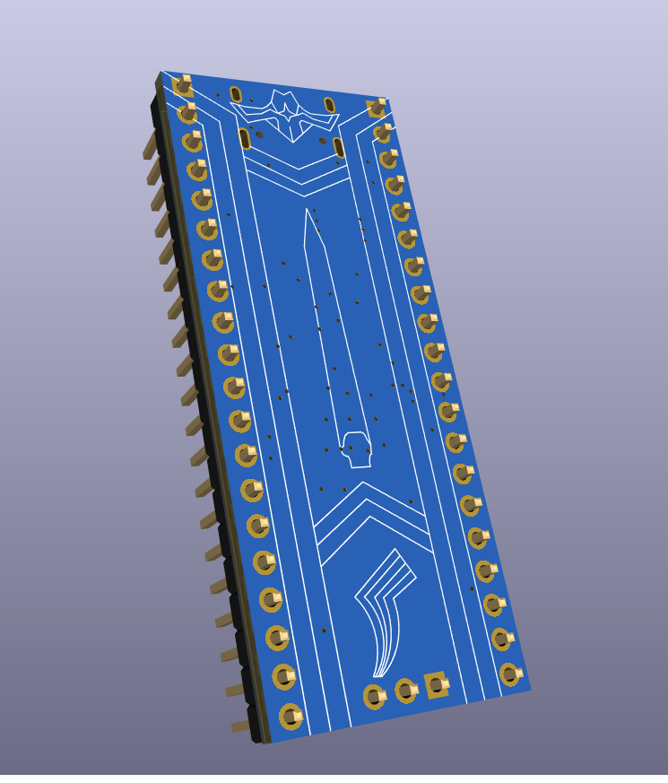
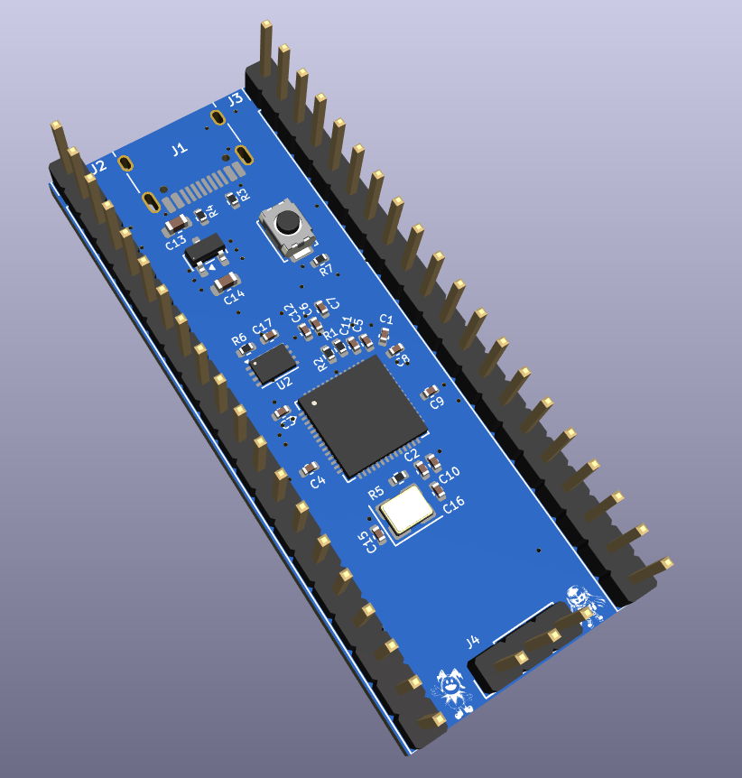

# Nahoboard
A simple development board that allows the user to prototype, write code, and test hardware functions without needing to design a custom PCB. It is inspired by the protagonist of Atlus' Shin Megami Tensei V game (in their Aogami form).

Renders:
### 
### 

